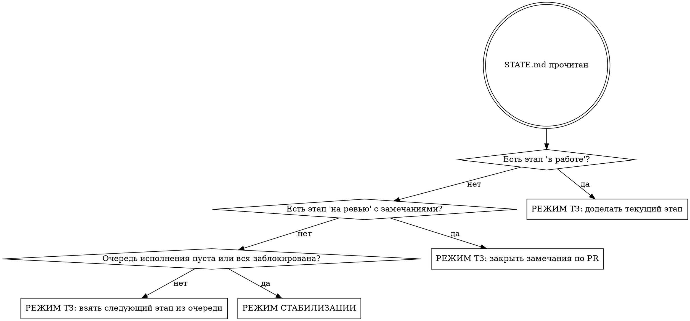

# Продолжение работы по мастер-ТЗ

Этот файл — единственная точка входа в работу по ТЗ. Он нужен, чтобы любая
сессия Claude Code, в любой момент, на любой машине, по короткой фразе
восстановила контекст и продолжила ровно с той точки, где остановились.

**Срабатывает по фразам:** «продолжай по ТЗ», «работай по тз», «что дальше по
тз», «продолжи работу по тз», `continue tz`, слэш-команда `/tz`.

Файл отслеживается git — он работает на свежем клоне и в облачной сессии, где
локальных скиллов нет.

**Карта файлов:**

| Файл | Роль |
|---|---|
| `docs/tz/MASTER.md` | Само ТЗ. Неизменяемо без решения владельца. |
| `docs/tz/STATE.md` | Где мы сейчас. Меняется постоянно. **Источник правды.** |
| `docs/superpowers/specs/` | Дизайны и карты — летопись, читать при необходимости. |
| `docs/superpowers/plans/` | Планы конкретных работ. |

---

## Шаг 0. Ориентировка (выполнять ВСЕГДА, без исключений)

Ничего не делать и ничего не утверждать, пока не выполнено всё:

```bash
git fetch --all --prune
git status --short
git branch --show-current
gh pr list --state all --limit 20
```

Затем прочитать `docs/tz/STATE.md` целиком.

**Почему `git fetch` обязателен:** без него локальные ветки выглядят
несмёрженными, а существующие PR — несуществующими. Это правило из `CLAUDE.md`,
нарушение приводит к отчётам-фантазиям.

### Сверка состояния с реальностью

`STATE.md` мог устареть — кто-то мог работать и не обновить его. Проверить:

- Статус говорит `на ревью`, а PR влит → обновить на `влит`, идти дальше.
- Статус говорит `не начат`, а ветка `feat/tz-NN-*` существует → кто-то начал;
  посмотреть её коммиты, обновить статус, продолжить с неё.
- Статус говорит `в работе`, а рабочее дерево чистое и ветки нет → работа
  потеряна; сказать об этом владельцу прямо, не делать вид, что её не было.

При любом расхождении — **сначала исправить `STATE.md`**, потом работать.

---

## Шаг 1. Выбор режима



Приоритет жёсткий: **доделать начатое важнее, чем начать новое.** Незакрытый
этап — это ветка, которая расходится с `develop` и дорожает каждый день.

---

## Шаг 2А. Режим ТЗ

1. Прочитать в `MASTER.md` раздел ровно того этапа, который взят. Не весь ТЗ —
   только свой этап плюс ЧАСТЬ A (принципы) и ЧАСТЬ G (чего не делать).
2. Если этап начинается с нуля — создать ветку от свежего `develop`:
   `feat/tz-NN-краткое-имя` (например `feat/tz-01-navigation`).
3. Разбить этап на нумерованные шаги. Один шаг = одно логическое изменение.
4. По каждому шагу:
   - показать владельцу текущий код фрагментом **до** правки;
   - сделать правку;
   - прогнать зелёный прогон (ниже);
   - дать команду проверки и способ отката;
   - обновить `STATE.md`;
   - **остановиться и отчитаться.** Не склеивать шаги.
5. Этап закончен → PR в `develop`, статус `на ревью`.

### Зелёный прогон — обязателен в конце каждого шага

```bash
pnpm typecheck
node packages/webapp/scripts/lang-check.js
pnpm --filter @bigfin/server test
```

Прогон не прошёл — шаг не закончен. Не отчитываться об успехе без вывода команд.

### Что нельзя нарушать (из ЧАСТИ A2 и G ТЗ)

- Один этап = один PR. Этапы не смешивать.
- Ни один существующий маршрут не удаляется и не отдаёт 404.
- Все строки — через `intl.get('...')` / `<T id="..." />`, ключи парно en+ru.
- Комментарии в коде — на русском.
- Миграции — только с рабочим `down()`, проверка `latest` → `rollback` → `latest`.
- Схемы БД не путать: общее между организациями → `database/system/migrations/`,
  принадлежит одной организации → `database/tenant/migrations/`.
- Сторожевые тесты расширять, а не отключать.
- Новые экраны — только на `components/ui/` + React Hook Form + Zod.
- Файлы с `@ts-nocheck` в рамках ТЗ не трогать.
- Не удалять файлы, ключи переводов, миграции, колонки БД без разрешения.
- Ломающие изменения (особенно миграции блока Б2) — предупредить владельца
  **до** того, как делать.
- Расчёт цифр никогда не отдаётся языковой модели. Модель формулирует, считает
  Bigfin.

---

## Шаг 2Б. Режим стабилизации

Включается, только если шаг 1 привёл сюда. Источники работы перечислены в
разделе 5 файла `STATE.md` — брать **первый непустой сверху**, не выбирать по
вкусу. Порядок там не случайный: красный CI блокирует всё остальное, а долг по
типам — самый дешёвый в единицу пользы.

Правила те же: одна тема = один PR, зелёный прогон, отчёт владельцу, запись в
журнал `STATE.md`.

Чего в режиме стабилизации **не** делать:
- не начинать этап ТЗ «заодно»;
- не рефакторить то, что не сломано;
- не отключать падающий тест, чтобы стало зелено — чинить причину.

---

## Шаг 3. Закрытие шага (выполнять ВСЕГДА)

1. Обновить `docs/tz/STATE.md`:
   - блок «Указатель» — всегда, даже если этап тот же;
   - строку этапа в таблице, если статус изменился;
   - «Обновлено» и «База develop»;
   - строку в «Журнал», если что-то закрыто.
2. Закоммитить изменение `STATE.md` вместе с работой шага.
3. Отчитаться владельцу простыми словами: что сделано, чем проверить, как
   откатить, что дальше.

Коммиты — Conventional Commits, тема со строчной буквы. Типа `i18n` в
конфиге нет — переводы идут как `feat`/`fix`. Мёрж-коммиты — `chore:`.

---

## Частые ошибки

| Ошибка | Чем плоха |
|---|---|
| Начать работу, не прочитав `STATE.md` | Дубль уже сделанного или потеря начатого |
| Не сделать `git fetch` | Отчёт о несуществующем состоянии веток и PR |
| Взять этап не по очереди из раздела 4 | Этапы зависят друг от друга, ЧАСТЬ F ТЗ это фиксирует |
| Сделать несколько шагов подряд без паузы | Владелец не разработчик, он теряет контроль над изменением |
| Забыть обновить `STATE.md` | Следующая сессия начнёт не с той точки — весь механизм ломается |
| Сказать «готово» без вывода зелёного прогона | Ложный отчёт |
