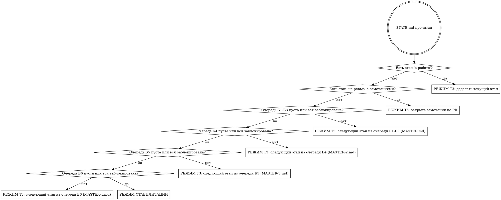

# Продолжение работы по мастер-ТЗ

Этот файл — единственная точка входа в работу по ТЗ. Он нужен, чтобы любая
сессия Claude Code, в любой момент, на любой машине, по короткой фразе
восстановила контекст и продолжила ровно с той точки, где остановились.

**Срабатывает по фразам:** «продолжай по ТЗ», «продолжай по тз», «работай по
тз», «что дальше по тз», «продолжи работу по тз», «продолжаем по ТЗ», «дальше по
тз», «по тз», «continue tz», слэш-команда `/tz`. Список не закрытый: любая
близкая по смыслу фраза владельца означает то же самое — выполнить этот файл с
шага 0.

Файл отслеживается git — он работает на свежем клоне и в облачной сессии, где
локальных скиллов нет.

**Карта файлов:**

| Файл | Роль |
|---|---|
| `docs/tz/MASTER.md` | ТЗ-1: блоки Б1–Б3, этапы 1–15. Неизменяемо без решения владельца. |
| `docs/tz/MASTER-2.md` | ТЗ-2: блок Б4 «Вход в продукт», этапы 16–28. Продолжение, а не замена. Неизменяемо без решения владельца. |
| `docs/tz/MASTER-3.md` | ТЗ-3: блок Б5 «Управленческая глубина», этапы 29–41. Написано по живому аудиту Финтабло. Продолжение, а не замена. Неизменяемо без решения владельца. |
| `docs/tz/MASTER-4.md` | ТЗ-4: блок Б6 «Современный интерфейс» (в духе Apple), этапы 42–56. Написано по живому проходу по стенду и чтению всей витрины. Продолжение, а не замена. Неизменяемо без решения владельца. |
| `docs/tz/STATE.md` | Где мы сейчас. Меняется постоянно. **Источник правды.** |
| `docs/superpowers/specs/` | Дизайны и карты — летопись, читать при необходимости. |
| `docs/superpowers/plans/` | Планы конкретных работ. |

---

## Шаг 0. Ориентировка (выполнять ВСЕГДА, без исключений)

Ничего не делать и ничего не утверждать, пока не выполнено всё:

```bash
git fetch --all --prune
git status --short
git branch --show-current
gh pr list --state all --limit 20
```

Затем прочитать `docs/tz/STATE.md` целиком.

**Почему `git fetch` обязателен:** без него локальные ветки выглядят
несмёрженными, а существующие PR — несуществующими. Это правило из `CLAUDE.md`,
нарушение приводит к отчётам-фантазиям.

### Сверка состояния с реальностью

`STATE.md` мог устареть — кто-то мог работать и не обновить его. Проверить:

- Статус говорит `на ревью`, а PR влит → обновить на `влит`, идти дальше.
- Статус говорит `не начат`, а ветка `feat/tz-NN-*` существует → кто-то начал;
  посмотреть её коммиты, обновить статус, продолжить с неё.
- Статус говорит `в работе`, а рабочее дерево чистое и ветки нет → работа
  потеряна; сказать об этом владельцу прямо, не делать вид, что её не было.

При любом расхождении — **сначала исправить `STATE.md`**, потом работать.

---

## Шаг 1. Выбор режима



**Четыре очереди, не одна.** Блоки Б1–Б3 (этапы 1–15), Б4 (16–28) и Б5
(29–41) закрыты по коду и ждут приёмки владельца; с 24.09.2026 работа идёт по
блоку Б6 (этапы 42–56) из `MASTER-4.md` — современный интерфейс в духе Apple.
Режим стабилизации включается, только когда пусты **все четыре** очереди.
Пустая очередь Б1–Б3, Б4 или Б5 сама по себе в стабилизацию не отправляет —
это самая частая ошибка после 20.09.2026.

Приоритет жёсткий: **доделать начатое важнее, чем начать новое.** Незакрытый
этап — это ветка, которая расходится с `develop` и дорожает каждый день.

---

## Шаг 2А. Режим ТЗ

1. Прочитать раздел ровно того этапа, который взят. Не весь ТЗ — только свой
   этап плюс общие правила.

   | Этап | Файл | Что ещё прочитать обязательно |
   |---|---|---|
   | 1–15 (блоки Б1–Б3) | `MASTER.md` | ЧАСТЬ A (принципы) и ЧАСТЬ G (чего не делать) |
   | 16–28 (блок Б4) | `MASTER-2.md` | раздел 0 (метки достоверности), раздел 12 (правила этапов), Приложение А (отклонённые идеи) и Приложение Б (что проверить самому) |
   | 29–41 (блок Б5) | `MASTER-3.md` | «Система маркировки достоверности» (в начале файла), раздел 7 (что в Bigfin уже есть), раздел 25 (правила этапов), раздел 33 (порядок и что нельзя переставлять), раздел 34 (чего делать не надо) и раздел 35 (что проверить самому) |
   | 42–56 (блок Б6) | `MASTER-4.md` | раздел 2 (принципы), раздел 3 (решения R1–R25 — не переигрывать), раздел 4 (текущее состояние), разделы 5–8 (дизайн-система, графики, каркас, шаблоны), свой этап в разделе 9, раздел 10 (правила и порядок), раздел 12 (чего делать не надо) |

   Метки в ТЗ-2 читать буквально: `[OBSERVED]` и `[CODE-CONFIRMED]` — проверено,
   `[INFERRED]` и `[PROPOSED]` — нет. Если в разделе «текущее состояние Bigfin»
   нет метки `[CODE-CONFIRMED]`, состояние **обязан проверить сам** до работы.

   В ТЗ-4 метки те же, без скобок: `OBSERVED` (открыто на живом стенде 24.09,
   указаны адрес и ширина), `CODE-CONFIRMED` (путь к файлу), `INFERRED`,
   `PROPOSED`. Правило то же: без `OBSERVED`/`CODE-CONFIRMED` — проверить самому.

2. Если этап начинается с нуля — создать ветку от свежего `develop`:
   `feat/tz-NN-краткое-имя` для этапов 1–15 (например `feat/tz-01-navigation`),
   `feat/tz2-NN-краткое-имя` для этапов 16–28 (например `feat/tz2-16-подготовка`),
   `feat/tz3-NN-краткое-имя` для этапов 29–41 (например `feat/tz3-29-фундамент`),
   `feat/tz4-NN-краткое-имя` для этапов 42–56 (например `feat/tz4-42-ремонт`).
3. Разбить этап на нумерованные шаги. Один шаг = одно логическое изменение.
4. По каждому шагу:
   - показать владельцу текущий код фрагментом **до** правки;
   - сделать правку;
   - прогнать зелёный прогон (ниже);
   - дать команду проверки и способ отката;
   - обновить `STATE.md`;
   - **остановиться и отчитаться.** Не склеивать шаги.
5. Этап закончен → PR в `develop`, статус `на ревью`.

### Зелёный прогон — обязателен в конце каждого шага

```bash
pnpm typecheck
node packages/webapp/scripts/lang-check.js
pnpm --filter @bigfin/server test
pnpm --filter @bigfin/webapp test:run
```

Четвёртая команда добавлена вместе с блоком Б4 (правило раздела 12 `MASTER-2.md`):
почти всё в Б4 — витрина, и сторожевые спеки живут там.

Прогон не прошёл — шаг не закончен. Не отчитываться об успехе без вывода команд.

### Что нельзя нарушать (из ЧАСТИ A2 и G ТЗ)

- Один этап = один PR. Этапы не смешивать.
- Ни один существующий маршрут не удаляется и не отдаёт 404.
- Все строки — через `intl.get('...')` / `<T id="..." />`, ключи парно en+ru.
- Комментарии в коде — на русском.
- Миграции — только с рабочим `down()`, проверка `latest` → `rollback` → `latest`.
- Схемы БД не путать: общее между организациями → `database/system/migrations/`,
  принадлежит одной организации → `database/tenant/migrations/`.
- Сторожевые тесты расширять, а не отключать.
- Новые экраны — только на `components/ui/` + React Hook Form + Zod.
- Файлы с `@ts-nocheck` в рамках ТЗ не трогать.
- Не удалять файлы, ключи переводов, миграции, колонки БД без разрешения.
- Ломающие изменения (особенно миграции блока Б2) — предупредить владельца
  **до** того, как делать.
- Расчёт цифр никогда не отдаётся языковой модели. Модель формулирует, считает
  Bigfin.

### Дополнительно для блока Б4 (Приложение А `MASTER-2.md`)

Эти идеи **отклонены владельцем ТЗ** — не возвращаться к ним и не предлагать:

- вторая дата у денежной операции (у Bigfin двойная запись, у конкурента её нет);
- отдельные таблицы дебиторки и кредиторки, таблица «статья → строка отчёта» —
  всё это производное, хранить значит завести второй источник правды;
- массовая миграция Blueprint → shadcn (прямой запрет ЧАСТИ G ТЗ-1);
- новые разделы меню: восемь пунктов остаются восемью;
- ИИ сверх уже существующего.

Отдельно: **экран не делается раньше ручки**. В проекте стоит сторож на запросы
к несуществующим путям, и работа «на моках» его не пройдёт.

### Дополнительно для блока Б5 (раздел 34 `MASTER-3.md`)

Метки достоверности в ТЗ-3 пишутся без скобок: `OBSERVED` и `CODE-CONFIRMED` —
проверено (у OBSERVED указаны раздел, route, действие и результат), `OBSERVED-UI`
— элемент виден, но действие до конца не проверено, `INFERRED` и `PROPOSED` — не
проверено. Правило то же: нет `CODE-CONFIRMED` в блоке «текущее состояние
Bigfin» — проверить самому до работы.

Эти решения приняты владельцем ТЗ-3 — не переигрывать и не предлагать иначе:

- дизайн Финтабло не копируется: берутся продуктовые паттерны, не пиксели,
  не тексты, не иллюстрации;
- бухгалтерский ОПиУ, Баланс и ДДС косвенный **не трогаются** — управленческий
  ОПиУ делается отдельным отчётом рядом;
- новой таблицы под «карту отчётов» не заводить (правило D2 ТЗ-2 сохраняется):
  карта выводится из полей статьи;
- `projects` остаётся `projects` в коде и «направлением» в интерфейсе;
- `pl_type` у пользовательских статей не угадывается эвристикой — пустой ярус
  виден строкой «Не отнесено к ярусу»;
- операции не удаляются физически — только soft-delete с корзиной;
- пишущих MCP-инструментов в первой версии нет, и ИИ не меняет финансовые
  данные — только предлагает действие с подтверждением человека;
- проценты при нулевой базе не показываются нигде в продукте;
- список банковских интеграций в рамках ТЗ-3 не расширяется;
- раздел «Проекты» (позиция «П») в рамках ТЗ-3 не оживляется.

Жёсткий порядок внутри Б5 (раздел 33 `MASTER-3.md`), нарушать нельзя:
колонки-периоды ОДДС — только после починки отбора по юрлицу в управленческих
свёртках; ярусы ОПиУ — только после появления `pl_type`; кэш отчётов — только
после того, как отчёты стабилизировались; корзина — до сверки, а не после;
AI CFO — последним, когда управленческий ОПиУ и ОДДС-матрица приняты.

### Дополнительно для блока Б6 (разделы 3, 10 и 12 `MASTER-4.md`)

Решения R1–R25 приняты по поручению владельца — не переигрывать. Главное:

- «Как у Apple» — это **принципы** (ясность, содержимое главнее хрома, глубина
  слоями, одна главная кнопка, спокойное движение, телефон первым классом,
  светлая и тёмная), а не пиксели: шрифт остаётся Inter, значки — lucide,
  главное действие — чернильное, жёлтый — одна метка на экран;
- этапы Б6 меняют **вид и удобство, не расчёты**: ручки сервера и схема базы
  не трогаются (исключения названы в §10.4 ТЗ-4);
- старые экраны массово **не переписываются** — их вид выравнивает мост тем
  `style/_theme-bridge.scss`; переписываются только окна из списка UI-052-3;
- новые библиотеки графиков, анимаций и UI-китов **не добавляются** (Recharts
  остаётся; исключение — dev-зависимость `@axe-core/playwright` в этапе 55);
- все графики — только через общий набор `components/ui/charts/` (этап 46) и
  по его девяти правилам: оси «тыс./млн ₽», без сглаживания, разрыв вместо
  нуля, без наклонных подписей, «Таблица» у каждого;
- **каждый этап заканчивается живым проходом**: снимки затронутых экранов на
  локальной копии витрины со стендовыми данными, 1440×900 и 390×844, и эти
  снимки просматриваются глазами до PR;
- восемь пунктов меню остаются восемью.

Жёсткий порядок (§10.1 ТЗ-4): 42 ремонт → 43 токены → 44 элементы кита →
45 каркас → 46 графики → 47–51 экраны (после 46, между собой независимы) →
52 формы (после 44) → 53 телефон → 54 тёмная тема → 55 доступность и скорость →
56 эталонные снимки и приёмка.

---

## Шаг 2Б. Режим стабилизации

Включается, только если шаг 1 привёл сюда. Источники работы перечислены в
разделе 5 файла `STATE.md` — брать **первый непустой сверху**, не выбирать по
вкусу. Порядок там не случайный: красный CI блокирует всё остальное, а долг по
типам — самый дешёвый в единицу пользы.

Правила те же: одна тема = один PR, зелёный прогон, отчёт владельцу, запись в
журнал `STATE.md`.

Чего в режиме стабилизации **не** делать:
- не начинать этап ТЗ «заодно»;
- не рефакторить то, что не сломано;
- не отключать падающий тест, чтобы стало зелено — чинить причину.

---

## Шаг 3. Закрытие шага (выполнять ВСЕГДА)

1. Обновить `docs/tz/STATE.md`:
   - блок «Указатель» — всегда, даже если этап тот же;
   - строку этапа в таблице, если статус изменился;
   - «Обновлено» и «База develop»;
   - строку в «Журнал», если что-то закрыто.
2. Закоммитить изменение `STATE.md` вместе с работой шага.
3. Отчитаться владельцу простыми словами: что сделано, чем проверить, как
   откатить, что дальше.

Коммиты — Conventional Commits, тема со строчной буквы. Типа `i18n` в
конфиге нет — переводы идут как `feat`/`fix`. Мёрж-коммиты — `chore:`.

---

## Частые ошибки

| Ошибка | Чем плоха |
|---|---|
| Начать работу, не прочитав `STATE.md` | Дубль уже сделанного или потеря начатого |
| Не сделать `git fetch` | Отчёт о несуществующем состоянии веток и PR |
| Взять этап не по очереди из раздела 4 | Этапы зависят друг от друга, ЧАСТЬ F ТЗ это фиксирует |
| Сделать несколько шагов подряд без паузы | Владелец не разработчик, он теряет контроль над изменением |
| Забыть обновить `STATE.md` | Следующая сессия начнёт не с той точки — весь механизм ломается |
| Сказать «готово» без вывода зелёного прогона | Ложный отчёт |
